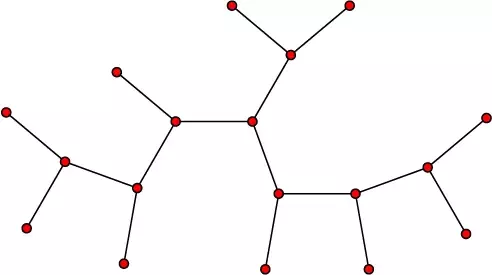
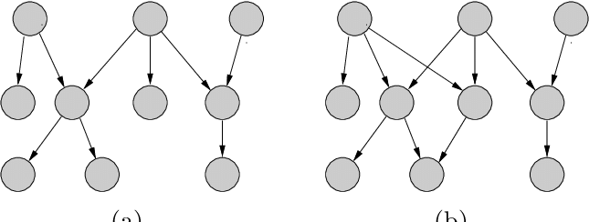

# Tree (graph theory)

 **tree**  ต้นไม้เป็นกราฟที่ไม่ได้บอกทิศทางซึ่งจุดยอดสองจุดใด ๆ เชื่อมต่อกันด้วยเส้นทางเดียวหรือเท่ากับ acyclic ที่เชื่อมต่อโดยตรง

**forest**  ฟอเรสต์เป็นกราฟที่ไม่ได้บอกทิศทางซึ่งมีสองจุดยอดที่เชื่อมต่อกันโดยมากที่สุดหนึ่งเส้นทาง

**polyforest**  or **directed forest** เป็นกราฟ acyclic ไม่ทิศทาง ซึ่งกราฟที่ไม่มีการอ้างอิงเป็นฟอเรสต์ กล่าวอีกนัยหนึ่ง if we replace its directed edges with undirected edges, we obtain an undirected graph that is acyclic.
